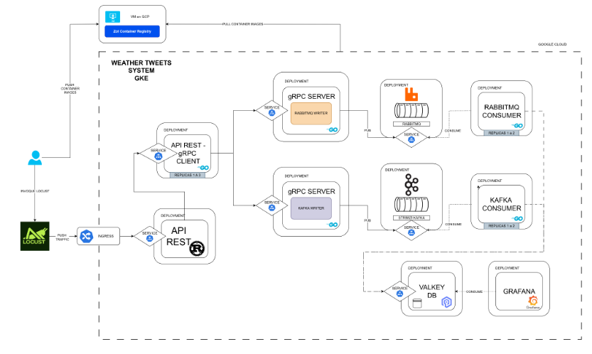

# Operating Systems & Cloud Infrastructure Portfolio

Academic engineering portfolio developed for **Operating Systems 1** at the
**Universidad de San Carlos de Guatemala (USAC)**.

The repository explores operating-system fundamentals and modern infrastructure
through practical projects involving Linux, virtualization, kernel modules,
containers, distributed services, Kubernetes, messaging, observability, and
load testing.

## Highlights

- Linux and Ubuntu Server administration
- KVM / QEMU virtualization
- Linux kernel modules written in C
- Backend services written in Go and Rust
- Docker and container registries
- Kubernetes deployments and services
- Google Cloud Platform
- REST and gRPC communication
- Apache Kafka and RabbitMQ
- Valkey / Redis-compatible data storage
- Grafana dashboards
- Horizontal Pod Autoscaling
- Locust load testing
- Bash automation

## Featured Project — Distributed Climate Monitoring Platform

The most complete project in this repository is a distributed system for
processing climate readings from different municipalities.

The solution combines containerized REST and gRPC services with asynchronous
messaging through Kafka and RabbitMQ. Consumers process the messages and persist
the resulting readings in Valkey, while Grafana provides visualization and
monitoring.

The original deployment used Kubernetes on Google Cloud Platform and a private
Zot container registry.

### Architecture



### Main technologies

| Area | Technologies |
| --- | --- |
| API / Services | Rust, Go, REST, gRPC, Protocol Buffers |
| Messaging | Apache Kafka, RabbitMQ |
| Data | Valkey |
| Containers | Docker |
| Orchestration | Kubernetes |
| Cloud | Google Cloud Platform |
| Observability | Grafana |
| Load testing | Locust |
| Autoscaling | Kubernetes HPA |

### Main components

- **Rust REST API** — receives climate data.
- **Go gRPC services** — coordinate internal service communication.
- **Kafka pipeline** — asynchronous event processing.
- **RabbitMQ pipeline** — alternative asynchronous messaging path.
- **Consumers** — process events and write climate readings to Valkey.
- **Valkey** — in-memory data store for climate information.
- **Grafana** — visualization and monitoring dashboards.
- **Locust** — load generation and performance testing.
- **Kubernetes** — deployment, service discovery, and scaling.

More details:

- [Project 3 technical case study](./proyecto3/README.md)
- [Original technical report (Spanish)](./proyecto3/Informe_Tecnico.md)

---

## Project 1 — Virtualization and Containerized Go APIs

This project explores infrastructure fundamentals by combining:

- Go APIs
- Docker containers
- KVM / QEMU virtual machines
- Linux networking
- a private Zot container registry

Multiple services were containerized and distributed across virtual machines,
providing practical experience with image distribution and virtualized
infrastructure.

Documentation:

- [`proyecto 1/ManualTecnicoInstrucciones.md`](./proyecto%201/ManualTecnicoInstrucciones.md)

---

## Project 2 — Linux Kernel Modules and Resource Monitoring

This project moves closer to operating-system internals.

It includes Linux kernel modules written in C and a Go daemon used to inspect
system and container-related information.

Technologies and concepts include:

- Linux kernel modules
- C
- Go
- `/proc`-style system information
- container monitoring
- Bash automation
- Docker-based components

Documentation:

- [Technical documentation](./proyecto-2/documentacion/manualTecnico.md)
- [User documentation](./proyecto-2/documentacion/manualUsuario.md)

---

## Additional Work

The repository also contains smaller exercises related to:

- Linux command-line administration
- Docker
- Kubernetes Pods
- Kubernetes Services
- NodePort
- infrastructure automation

See:

- [`tarea-1/`](./tarea-1/)
- [`practica-unica/`](./practica-unica/)

---

## Repository Structure

```text
.
├── tarea-1/           # Linux and container exercises
├── practica-unica/    # Kubernetes practice
├── proyecto 1/        # Go APIs, VMs, Docker and Zot
├── proyecto-2/        # Kernel modules and monitoring
└── proyecto3/         # Distributed cloud-native climate platform
```

## Public Repository Security

This repository has been prepared for public portfolio use.

The public version intentionally:

- excludes generated kernel build artifacts;
- excludes Python caches and local build outputs;
- does not contain real `.env` files;
- does not contain real Kubernetes credentials;
- uses Kubernetes `Secret` references for sensitive configuration;
- uses placeholder container-registry URLs in public manifests.

An example Kubernetes secret template is available at:

```text
proyecto3/yamls/secrets.example.yaml
```

Real credentials must never be committed.

## Reproducibility Note

This repository preserves academic projects originally developed and deployed
during the course.

The Kubernetes manifests are retained primarily as technical and portfolio
artifacts. Public image references have been replaced by registry placeholders,
and environment-specific configuration from the original deployment has been
removed.

Running the complete distributed platform again may therefore require:

1. building the custom service images;
2. publishing them to your own container registry;
3. replacing the placeholder image references;
4. creating local Kubernetes Secrets;
5. reviewing environment-specific service endpoints;
6. deploying the resources to a Kubernetes cluster.

This is intentionally not presented as a one-command production deployment.

## Author

**Nelson Emanuel Cún Bálan**

Backend Developer · Software Engineer

- GitHub: [github.com/NelsonCun](https://github.com/NelsonCun)
- LinkedIn: [linkedin.com/in/nelson-emanuel-cun](https://www.linkedin.com/in/nelson-emanuel-cun/)
