# Manual Técnico — Proyecto 1
**Desarrollo de Contenedores y Gestión de Imágenes en Entornos Virtualizados**  
Curso: Sistemas Operativos 1  

- Nombre: Nelson Emanuel Cún Bálan 
- Carné: 201222010
- Sección: P 

---

## 2. Introducción
Este manual técnico detalla los pasos seguidos para completar el Proyecto 1 del curso de Sistemas Operativos 1. El objetivo principal del proyecto es desarrollar tres APIs en Go, contenerizarlas y gestionarlas utilizando runtimes de contenedores en un entorno virtualizado con KVM. Además, se implementa un registro privado de imágenes utilizando Zot.

---

## 3. Requisitos Previos
- Hardware recomendado:  
  - CPU con soporte para virtualización (Intel VT-x o AMD-V)  
  - Al menos 8 GB de RAM  
  - Al menos 40 GB de espacio en disco libre
- Software necesario:  
  - Linux Host con KVM
  - Ubuntu Server 22.04 en cada VM  
  - Acceso a internet y GitHub  
- Versiones utilizadas de software:
  - Golang 1.22-alpine
  - linux
  - Ubuntu Server 22.04.5 LTS

---

## 4. Arquitectura del Sistema
- **Diagrama general** (VM1, VM2, VM3 con sus IPs y contenedores).  
- Explicación de roles:  
  - VM1 → API1 y API2 (containerd)  
  - VM2 → API3 (containerd)  
  - VM3 → Registro privado Zot (Docker)  
- Puertos utilizados (8081, 8082, 8083, 5000).  

---

## 5. Instalación y Configuración de las VMs
### 5.1. Instalación de KVM

#### 5.1.1. Verificar compatibilidad del procesador
Antes de instalar KVM, se debe comprobar si el procesador soporta virtualización:

```bash
egrep -c '(vmx|svm)' /proc/cpuinfo
```

Si el resultado es >0, el CPU soporta KVM.

Si devuelve 0, la virtualización no está habilitada.

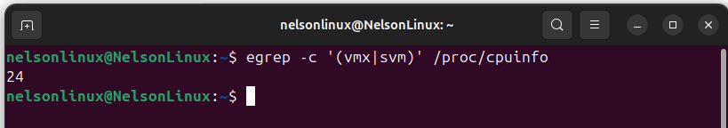

#### 5.1.2. Instalar KVM y herramientas necesarias

```bash
sudo apt update
sudo apt install -y qemu-kvm libvirt-daemon-system libvirt-clients bridge-utils virt-manager
```

**qemu-kvm**: motor de virtualización.

**libvirt:** gestiona máquinas virtuales.

**virt-manager:** interfaz gráfica para administrar VMs.

**bridge-utils:** permite redes puente (para que las VMs tengan IP propia en la LAN)

#### 5.1.3. Verificar instalación

```bash
kvm-ok
virsh list --all
```
Si `kvm-ok` indica que KVM está habilitado y `virsh list --all` muestra una lista vacía, la instalación fue exitosa.

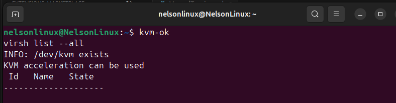

#### 5.1.4. Configurar permisos
Agregar el usuario al grupo `libvirt` para gestionar VMs sin sudo:

```bash
sudo usermod -aG kvm $USER
sudo usermod -aG libvirt $USER
newgrp kvm
```

### 5.2. Creación de las máquinas virtuales

#### 5.2.1. Descargar la imagen de Ubuntu Server 22.04

https://ubuntu.com/download/server/thank-you?version=22.04.5&architecture=amd64&lts=true

#### 5.2.2 Preparación de la ISO para virt-manager
De forma predeterminada, libvirt administra sus discos e ISOs desde el directorio:

```bash
/var/lib/libvirt/images
```
Por este motivo se trasladó la ISO descargada hacia este directorio:

```bash
sudo mv ~/Descargas/ubuntu-22.04.5-live-server-amd64.iso /var/lib/libvirt/images
```

Virt-manager reconoce de inmediato los archivos que están en este directorio. Además se centralizan los discos e ISOs en el storage pool por defecto.

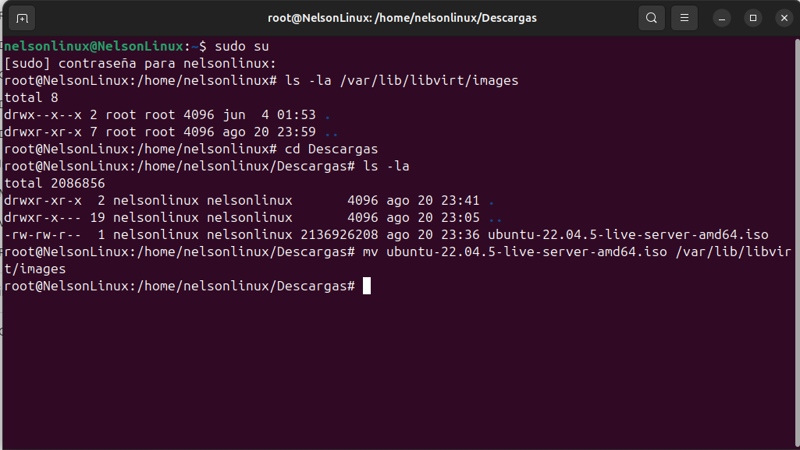

#### 5.2.1. Crear las VM

El siguiente proceso se repite para cada una de las tres VMs (vm1, vm2, vm3):

##### Abrimos Virt-Manager
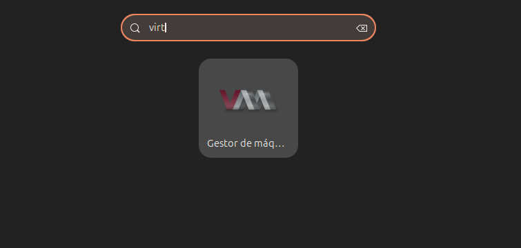

##### Elegimos crear una nueva máquina virtual

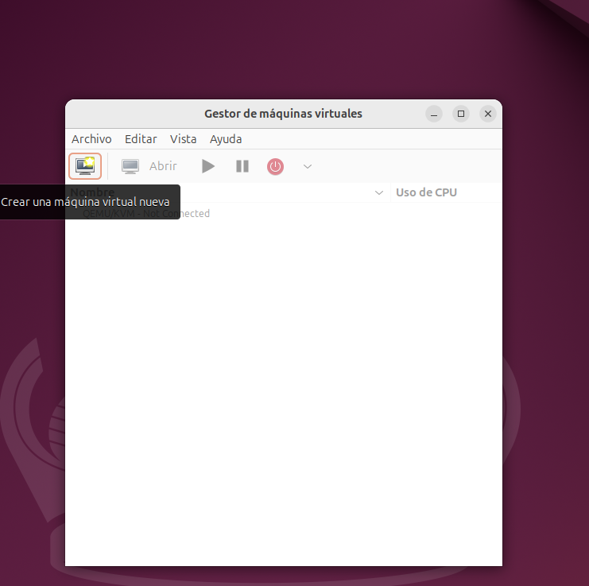

##### Elegimos medio de instalación local
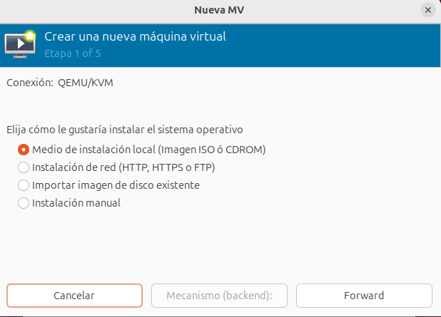

##### Seleccionamos la imagen ISO de Ubuntu Server 22.04.5
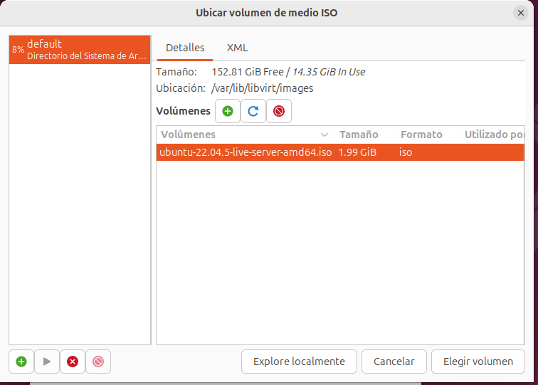

##### Elegimos la RAM y el número de CPUs
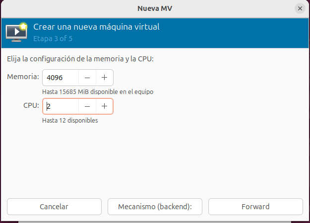

##### Asignamos el tamaño del disco (20 GB para cada VM)
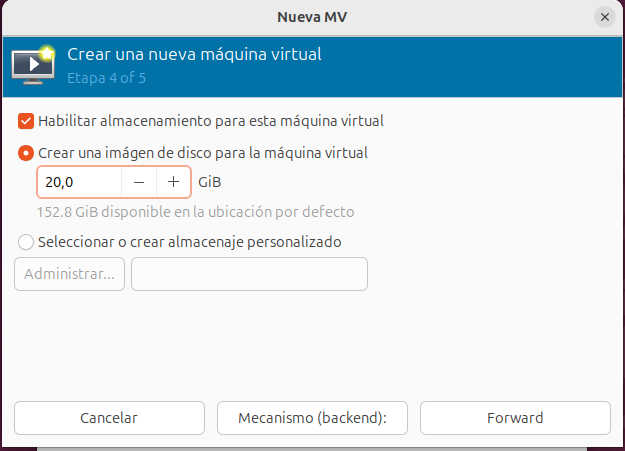

##### Asignamos nombre a la VM (vm1, vm2, vm3)

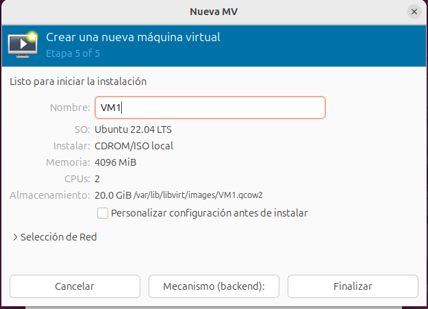

##### Se crea la VM y se realizan las configuraciones iniciales
- Se configuran algunas opciones como el idioma, el teclado, el tipo de instalación (servidor en nuestro caso), nombre de usuario, contraseña, etc.

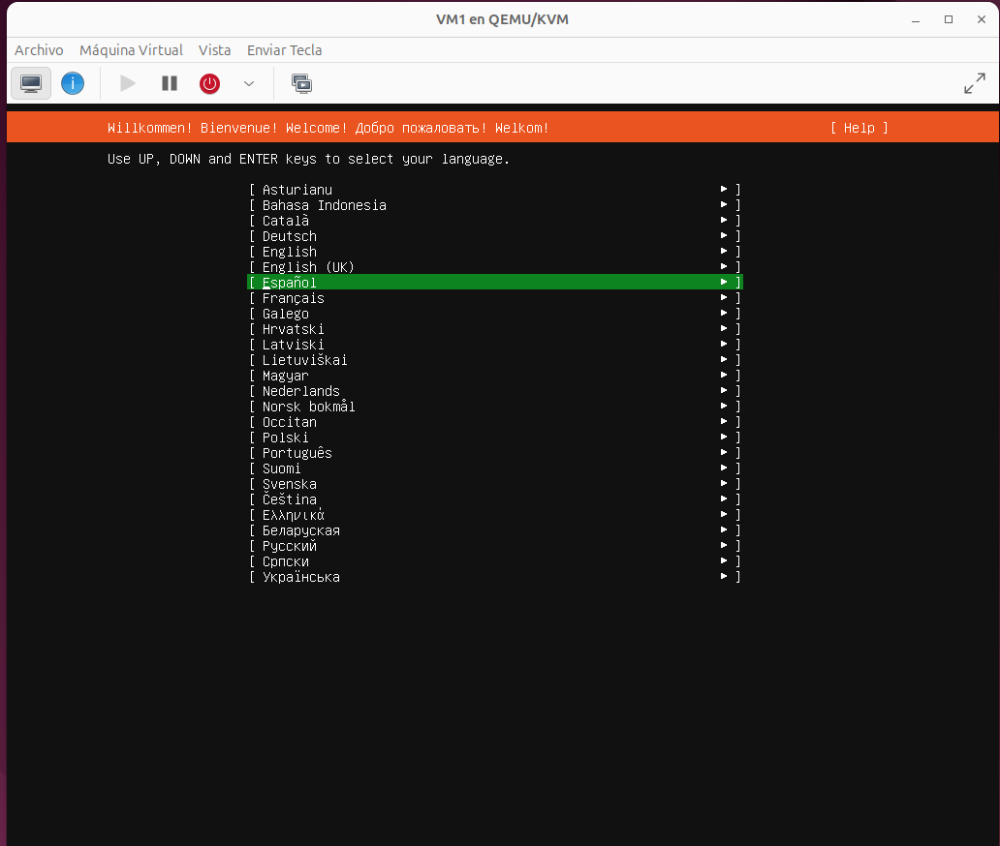
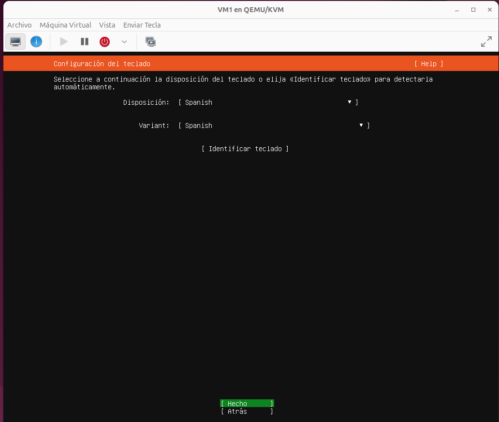
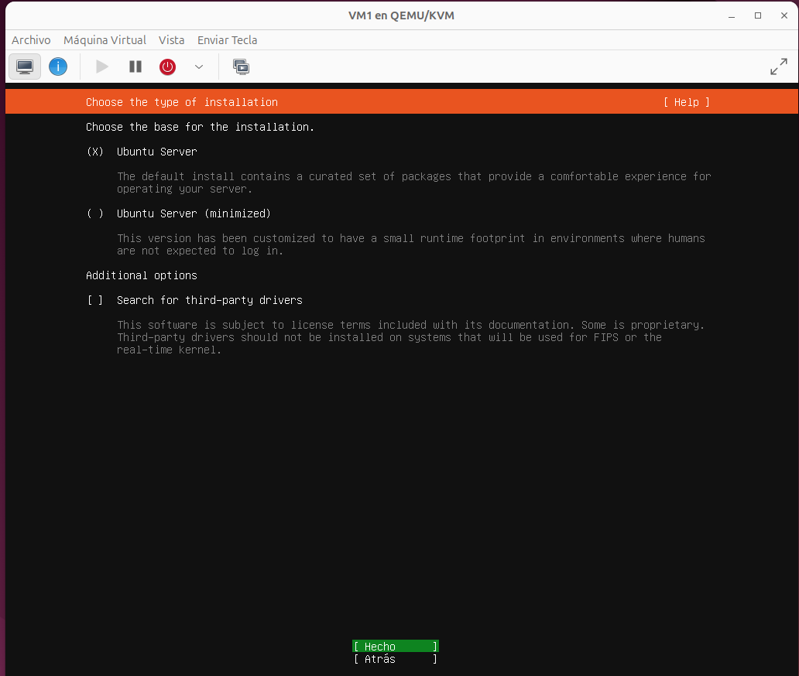
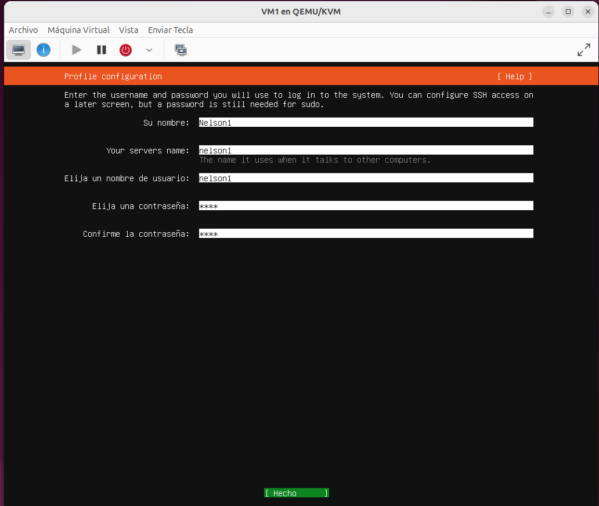

##### Se reincicia la VM y ya se puede acceder a ella.
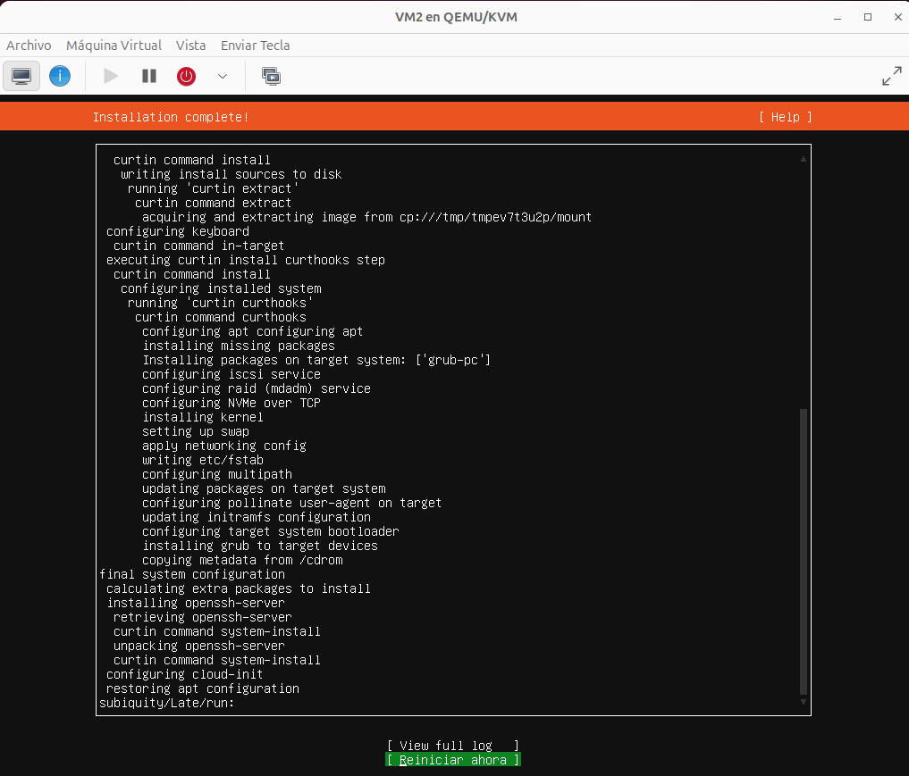
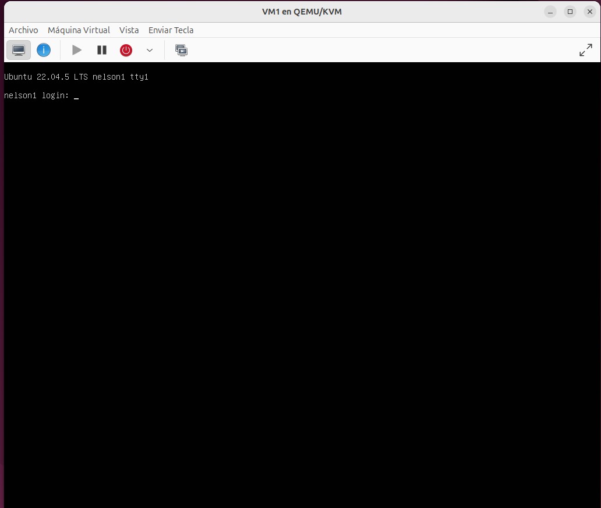


### 5.3 Instalación de runtimes
- **VM1 y VM2** → containerd


- **VM3** → Docker + Zot  

---

## 6. Desarrollo de las APIs

### 6.1 Lenguaje y librerías utilizadas (Go).  

### 6.2 Estructura de directorios del repositorio.  

### 6.3 Explicación del código fuente (main.go).  
- Endpoints obligatorios  
- Respuesta en formato JSON  
- Variables de entorno utilizadas  

---

## 7. Creación de Contenedores
### 7.1 Dockerfiles de cada API  
### 7.2 Construcción de imágenes con nerdctl
 

---

## 8. Configuración del Registro Zot
### 8.1 Instalación de Zot en VM3  
### 8.2 Configuración del archivo
### 8.3 Subida y descarga de imágenes  

---

## 9. Ejecución de Contenedores
- Comandos para correr cada API en su VM.  
- Configuración de variables de entorno.  
- Pruebas locales (`curl /ping`).  

---

## 10. Comunicación entre APIs
- Pruebas de endpoints requeridos:  
  - API1 llama a API2 y API3  
  - API2 llama a API1 y API3  
  - API3 llama a API1 y API2  
- Ejemplos de respuestas JSON.  
- Capturas de pantalla de `curl` o Postman.  

---

## 12. Conclusiones