# Manual Técnico y de Instrucciones — Proyecto 1
**Desarrollo de Contenedores y Gestión de Imágenes en Entornos Virtualizados**  
Curso: Sistemas Operativos 1  

- Nombre: Nelson Emanuel Cún Bálan 
- Carné: 201222010
- Sección: P 

---

## 2. Introducción
Este manual técnico detalla los pasos seguidos para completar el Proyecto 1 del curso de Sistemas Operativos 1. El objetivo principal del proyecto es desarrollar tres APIs en Go, contenerizarlas y gestionarlas utilizando runtimes de contenedores en un entorno virtualizado con KVM. Además, se implementa un registro privado de imágenes utilizando Zot.

---

## 3. Requisitos Previos
- Hardware recomendado:  
  - CPU con soporte para virtualización (Intel VT-x o AMD-V)  
  - Al menos 8 GB de RAM  
  - Al menos 40 GB de espacio en disco libre
- Software necesario:  
  - Linux Host con KVM
  - Ubuntu Server 22.04 en cada VM  
  - Acceso a internet y GitHub  
- Versiones utilizadas de software:
  - Golang 1.22-alpine
  - linux
  - Ubuntu Server 22.04.5 LTS
  - Docker 20.10.24
  - containerd 1.6.21
  - Zot latest
  - Virt-manager 4.2.0
  - QEMU 6.2.0
  - libvirt 8.0.0
  - bridge-utils 1.6
  - fiber v2.39.0
  - go1.22.2
  - Dockerfile v20.10.24
  - curl 7.81.0

---

## 4. Arquitectura del Sistema
- **Diagrama general** (VM1, VM2, VM3 con sus IPs y contenedores).  
- Explicación de roles:  
  - VM1 → API1 y API2 (containerd)  
  - VM2 → API3 (containerd)  
  - VM3 → Registro privado Zot (Docker)  
- Puertos utilizados (8081, 8082, 8083, 5000). 

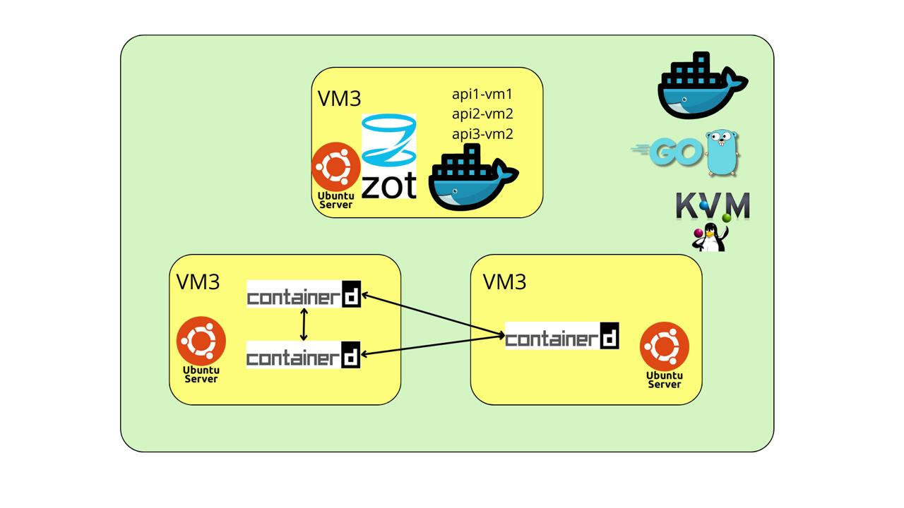

---

## 5. Instalación y Configuración de las VMs
### 5.1. Instalación de KVM

#### 5.1.1. Verificar compatibilidad del procesador
Antes de instalar KVM, se debe comprobar si el procesador soporta virtualización:

```bash
egrep -c '(vmx|svm)' /proc/cpuinfo
```

Si el resultado es >0, el CPU soporta KVM.

Si devuelve 0, la virtualización no está habilitada.


#### 5.1.2. Instalar KVM y herramientas necesarias

```bash
sudo apt update
sudo apt install -y qemu-kvm libvirt-daemon-system libvirt-clients bridge-utils virt-manager
```

**qemu-kvm**: motor de virtualización.

**libvirt:** gestiona máquinas virtuales.

**virt-manager:** interfaz gráfica para administrar VMs.

**bridge-utils:** permite redes puente (para que las VMs tengan IP propia en la LAN)

#### 5.1.3. Verificar instalación

```bash
kvm-ok
virsh list --all
```
Si `kvm-ok` indica que KVM está habilitado y `virsh list --all` muestra una lista vacía, la instalación fue exitosa.


#### 5.1.4. Configurar permisos
Agregar el usuario al grupo `libvirt` para gestionar VMs sin sudo:

```bash
sudo usermod -aG kvm $USER
sudo usermod -aG libvirt $USER
newgrp kvm
```

### 5.2. Creación de las máquinas virtuales

#### 5.2.1. Descargar la imagen de Ubuntu Server 22.04

https://ubuntu.com/download/server/thank-you?version=22.04.5&architecture=amd64&lts=true

#### 5.2.2 Preparación de la ISO para virt-manager
De forma predeterminada, libvirt administra sus discos e ISOs desde el directorio:

```bash
/var/lib/libvirt/images
```
Por este motivo se trasladó la ISO descargada hacia este directorio:

```bash
sudo mv ~/Descargas/ubuntu-22.04.5-live-server-amd64.iso /var/lib/libvirt/images
```

Virt-manager reconoce de inmediato los archivos que están en este directorio. Además se centralizan los discos e ISOs en el storage pool por defecto.


#### 5.2.1. Crear las VM

El siguiente proceso se repite para cada una de las tres VMs (vm1, vm2, vm3):

##### Abrimos Virt-Manager


##### Elegimos crear una nueva máquina virtual


##### Elegimos medio de instalación local


##### Seleccionamos la imagen ISO de Ubuntu Server 22.04.5


##### Elegimos la RAM y el número de CPUs


##### Asignamos el tamaño del disco (20 GB para cada VM)


##### Asignamos nombre a la VM (vm1, vm2, vm3)


##### Se crea la VM y se realizan las configuraciones iniciales
- Se configuran algunas opciones como el idioma, el teclado, el tipo de instalación (servidor en nuestro caso), nombre de usuario, contraseña, etc.


##### Se reincicia la VM y ya se puede acceder a ella.


### 5.3 Instalación de runtimes
- **VM1 y VM2** → containerd

Para las VMs que ejecutarán las APIs (vm1 y vm2), se instalará containerd como runtime de contenedores. Esto permite ejecutar contenedores sin Docker, utilizando una alternativa más ligera y eficiente.

Aquí se muestra el proceso de instalación y configuración de containerd para la VM1. El mismo proceso se repite para la VM2.

#### 5.3.1. Actualizamos paquetes y dependencias:

```bash
sudo apt update
sudo apt upgrade -y
sudo apt install -y ca-certificates curl gnupg lsb-release
```

#### 5.3.2. Se agrega el repositorio oficial de Docker para que se tenga la versión más reciente:

```bash
sudo mkdir -p /etc/apt/keyrings
curl -fsSL https://download.docker.com/linux/ubuntu/gpg | sudo gpg --dearmor -o /etc/apt/keyrings/docker.gpg

echo \
  "deb [arch=$(dpkg --print-architecture) signed-by=/etc/apt/keyrings/docker.gpg] https://download.docker.com/linux/ubuntu \
  $(lsb_release -cs) stable" | sudo tee /etc/apt/sources.list.d/docker.list > /dev/null
```

#### 5.3.3. Instalar Containerd

```bash
sudo apt update
sudo apt install -y containerd.io
```

#### 5.3.4. Configurar Containerd con valores por defecto

```bash
sudo mkdir -p /etc/containerd
sudo containerd config default | sudo tee /etc/containerd/config.toml
```

#### 5.3.5. Iniciar Containerd

```bash
sudo systemctl restart containerd
sudo systemctl enable containerd
sudo systemctl status containerd
```

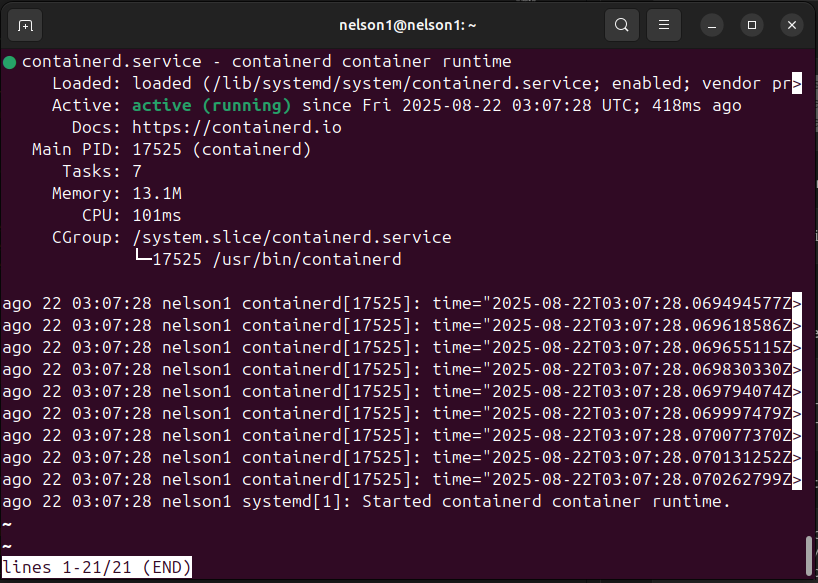

Esto nos indica que containerd está instalado y corriendo correctamente.

#### 5.3.6. Verificar que containerd está instalado y corriendo

```bash
containerd --version
```
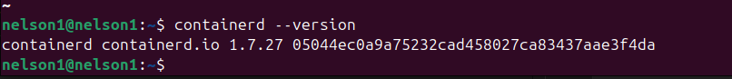


- **VM3** → Docker

#### 5.3.1. Actualizamos paquetes y dependencias:

```bash
sudo apt update
sudo apt upgrade -y
sudo apt install -y ca-certificates curl gnupg lsb-release
```

#### 5.3.2. Se agrega el repositorio oficial de Docker para que se tenga la versión más reciente:

```bash
sudo mkdir -p /etc/apt/keyrings
curl -fsSL https://download.docker.com/linux/ubuntu/gpg | sudo gpg --dearmor -o /etc/apt/keyrings/docker.gpg

echo \
  "deb [arch=$(dpkg --print-architecture) signed-by=/etc/apt/keyrings/docker.gpg] https://download.docker.com/linux/ubuntu \
  $(lsb_release -cs) stable" | sudo tee /etc/apt/sources.list.d/docker.list > /dev/null
```

#### 5.3.3. Instalar Docker Engine

```bash
sudo apt update
sudo apt install -y docker-ce docker-ce-cli containerd.io docker-buildx-plugin docker-compose-plugin
```

#### 5.3.4. Iniciar Docker

```bash
sudo systemctl start docker
sudo systemctl enable docker
sudo systemctl status docker
```
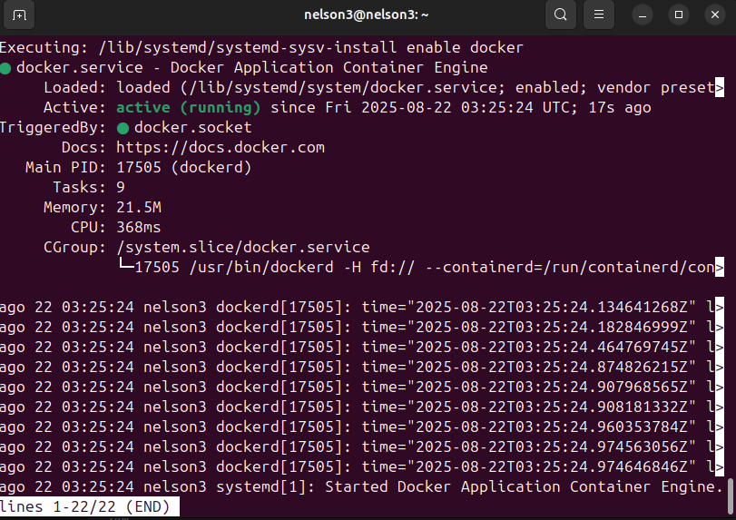

Esto nos indica que Docker está instalado y corriendo correctamente.

#### 5.3.5. Verificar que Docker está instalado y corriendo

```bash
docker --version
```

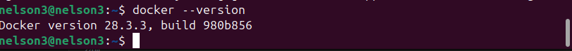

---

## 6. Desarrollo de las APIs

### 6.1 Lenguaje y librerías utilizadas (Go).  
Instalamos go1.22.2 en cada VM.

Descargamos Go 1.22.2 desde el sitio oficial.

```bash
wget https://go.dev/dl/go1.22.2.linux-amd64.tar.gz
```

Descomprimimos el archivo descargado:

```bash
sudo tar -C /usr/local -xzf go1.22.2.linux-amd64.tar.gz
```

Agregamos Go al PATH del sistema:

```bash
export PATH=$PATH:/usr/local/go/bin
export GOPATH=$HOME/go
export PATH=$PATH:$GOPATH/bin
```

Recargamos la configuración del shell:

```bash
source ~/.bashrc
```

Verificamos la instalación:

```bash
go version
```

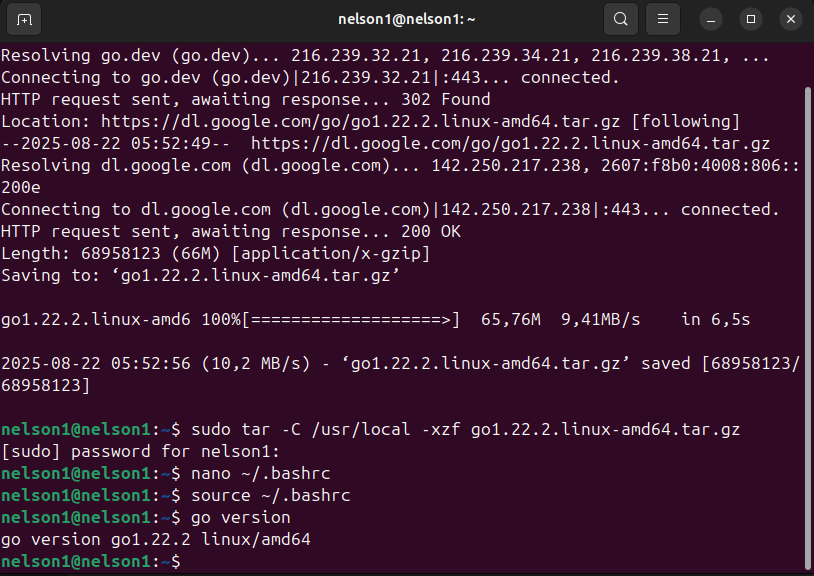

### 6.2 Estructura de directorios del repositorio.  

- Descripción de cada archivo y carpeta.
Usamos una carpeta llamada `go_projects` en donde creamos las carpetas `api1`, `api2` y `api3` para cada API respectivamente.

### 6.1 En cada carpeta de API, se tiene la siguiente estructura:

```
api#/
│── Dockerfile
│── go.mod
│── go.sum
│── main.go
```
### 6.2.1. Descripción de archivos:
- `Dockerfile`: Define cómo se construye la imagen del contenedor para la API.
- `go.mod`: Archivo de módulos de Go que define las dependencias del proyecto.
- `go.sum`: Archivo que asegura la integridad de las dependencias.
- `main.go`: Código fuente principal de la API.

### 6.2.2. Inicialización del módulo Go
En cada carpeta de API, se inicializa un módulo de Go con el siguiente comando:

```bash
go mod init api#
```

### 6.2.3. Creación del archivo main.go

El archivo `main.go` contiene el código fuente de la API, incluyendo los endpoints y la lógica para manejar las solicitudes HTTP.

```
touch main.go
```

Este archivo contiene el siguiente código (se da el ejemplo de la API1):

```go
package main

import (
	"fmt"
	"log"
	"net/http"

	"github.com/gofiber/fiber/v2"
)

func main() {
	app := fiber.New()

	// Endpoint principal de api1

	app.Get("/", func(c *fiber.Ctx) error {
		return c.SendString("Hola, responde la API1: API1 en la VM1, desarrollada por el estudiante Nelson Cún con carnet: 201222010")
	})

	// Endpoint para llamar a api2
	app.Get("/api1/201222010/llamar-a-api2", func(c *fiber.Ctx) error {
		// Hacer petición a API2
		resp, err := http.Get("http://localhost:8082/")
		if err != nil {
			return c.Status(fiber.StatusInternalServerError).SendString(fmt.Sprintf("Error al llamar a API2: %v", err))
		}
		defer resp.Body.Close()

		// Leer respuesta de API2
		buf := make([]byte, 1024)
		n, _ := resp.Body.Read(buf)
		api2Response := string(buf[:n])

		return c.SendString(fmt.Sprintf("Respuesta de API2: %s", api2Response))
	})

	// Endpoint para llamar a api3
	app.Get("/api1/201222010/llamar-a-api3", func(c *fiber.Ctx) error {
		// Hacer petición a API3
		resp, err := http.Get("http://localhost:8083/")
		if err != nil {
			return c.Status(fiber.StatusInternalServerError).SendString(fmt.Sprintf("Error al llamar a API3: %v", err))
		}
		defer resp.Body.Close()

		// Leer respuesta de API3
		buf := make([]byte, 1024)
		n, _ := resp.Body.Read(buf)
		api3Response := string(buf[:n])

		return c.SendString(fmt.Sprintf("Respuesta de API3: %s", api3Response))
	})

	// Iniciar servidor en el puerto 8081
	log.Fatal(app.Listen("0.0.0.0:8081"))

}
```

So corremos el comando `go run main.go` en cada carpeta de API, se inicia el servidor de la API correspondiente.

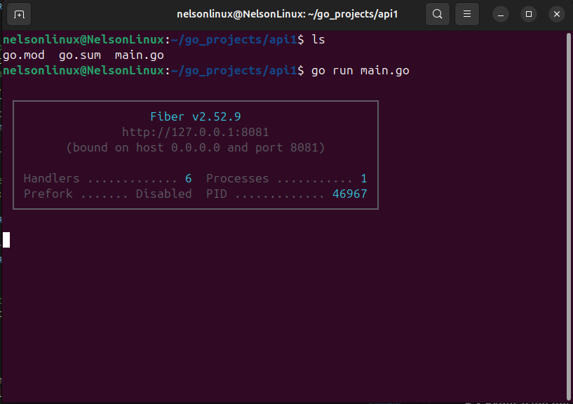


## 7. Creación de Contenedores
### 7.1 Dockerfiles de cada API

El archivo `Dockerfile` define cómo se construye la imagen del contenedor para cada API. A continuación se muestra un ejemplo del `Dockerfile` para la API1:

```Dockerfile
# Stage 1: build
FROM golang:1.22-alpine AS builder
WORKDIR /app

COPY go.mod go.sum ./
RUN go mod download
COPY . .
RUN go mod tidy
RUN CGO_ENABLED=0 GOOS=linux go build -o /app/api1 .

# Stage 2: runtime
FROM alpine:3.22
WORKDIR /app
COPY --from=builder /app/api1 .
EXPOSE 8081
CMD ["./api1"]
```

### 7.2 Construcción de imágenes con Docker

Para construir las imágenes de cada API, se utiliza el comando `docker build` en la carpeta correspondiente a cada API. Por ejemplo, para la API1:

```bash
docker build -t api1-vm1:image1 .
```

Podemos verficar que la imagen se creó correctamente con:

```bash
sudo docker images
```
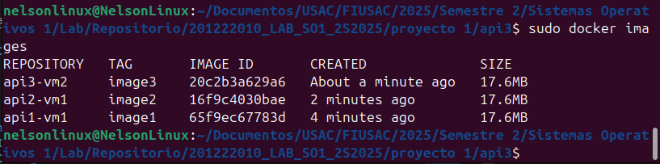

---

## 8. Configuración del Registro Zot
### 8.1 Instalación de Zot en VM3

```bash
docker run -d -p 5000:5000 --name zot ghcr.io/project-zot/zot-linux-amd64:latest
```
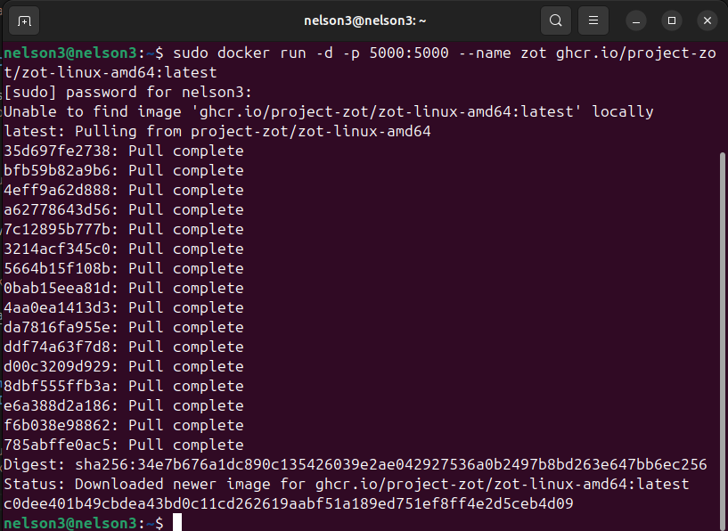

### 8.2 Configuración del archivo

Desde el host editamos la configuración de Docker para que apunte al registro privado Zot:

```bash
sudo nano /etc/docker/daemon.json
```
Agregamos la siguiente configuración:

```json
{
  "insecure-registries" : ["192.168.122.13:5000"]
}
```

Reiniciamos el servicio de Docker para aplicar los cambios:

```bash
sudo systemctl restart docker
```

### 8.3 Subida y descarga de imágenes  

Subimos las imagenes de las apis a Zot. Aquí solo mostraré el procedimiento de la api1.

```bash
docker tag api1-vm1:image1 192.168.122.13:5000/api1-vm1:image1
```
```bash
docker push 192.168.122.13:5000/api1-vm1:image1
```

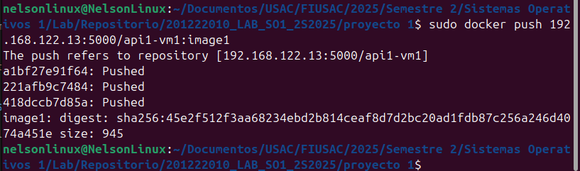

Verificamos que la imagen se subió correctamente al registro Zot:

```bash
curl http://192.168.122.13:5000/v2/_catalog
```
Debería mostrar la imagen `api1-vm1`.


---

## 9. Descargamos las imágenes de la VM3 en la VM1 y VM2

Ahora descargamos las imágenes desde el registro Zot en las VMs que ejecutan las APIs (VM1 y VM2). Aquí se muestra el procedimiento para la API1:

```bash
sudo ctr images pull --plain-http 192.168.122.13:5000/api1-vm1:image1
``` 
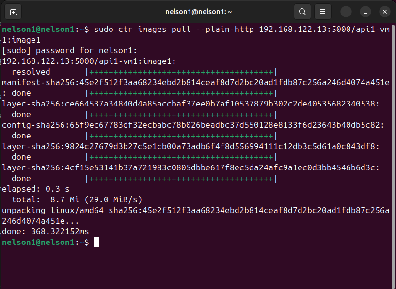

Verificamos que la imagen se descargó correctamente:

```bash
sudo ctr images ls
```
Debería mostrar la imagen `api1-vm1`.

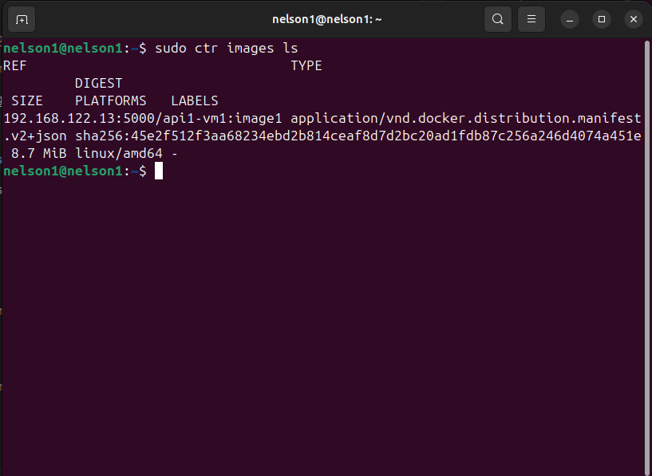

Corremos la imagen de la API1 en la VM1:

```bash
sudo ctr run -d --net-host 192.168.122.13:5000/api1-vm1:image1 api1-vm1-containerd
```
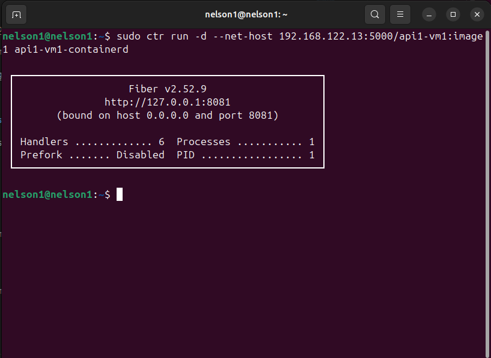

---

## 10. Comunicación entre APIs
- Pruebas de endpoints requeridos:  
  - API1 llama a API2

  

  - API1 llama a API3

  

  - API2 llama a API1
  
  

  - API2 llama a API3
  
  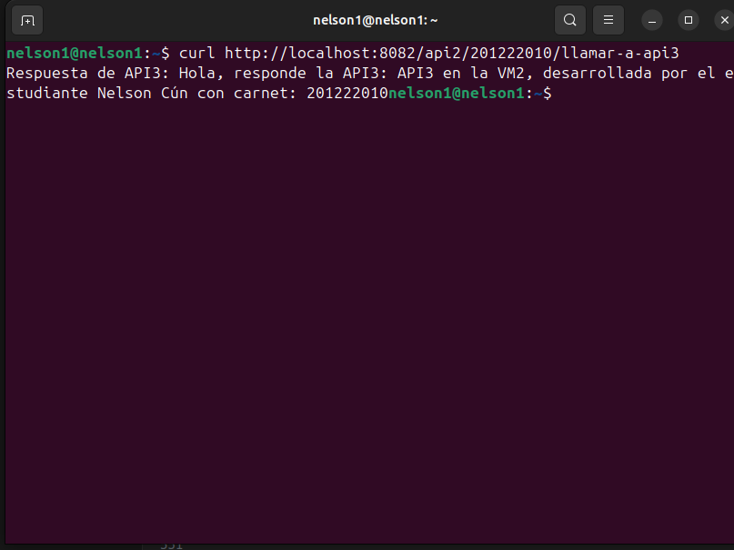

  - API3 llama a API1
  
  

  - API3 llama a API2
  
  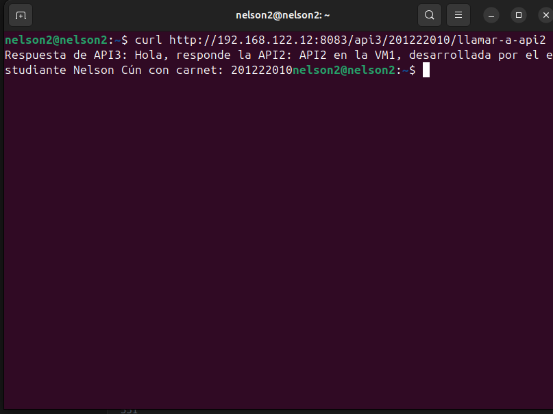

---

## 12. Conclusiones

Este proyecto contribuye a la comprensión de cómo es trabajar las máquinas virtuales, pero también a comprender el concepto de imagen y contenedor, así como su importancia para poder utilizar de forma eficiente los recursos que tenemos aprovechando de mejor forma el espacio de la memorio RAM como del SSD. También permitió practicar la forma en que se crean las máquinas virtuales y cómo se pueden administrar.