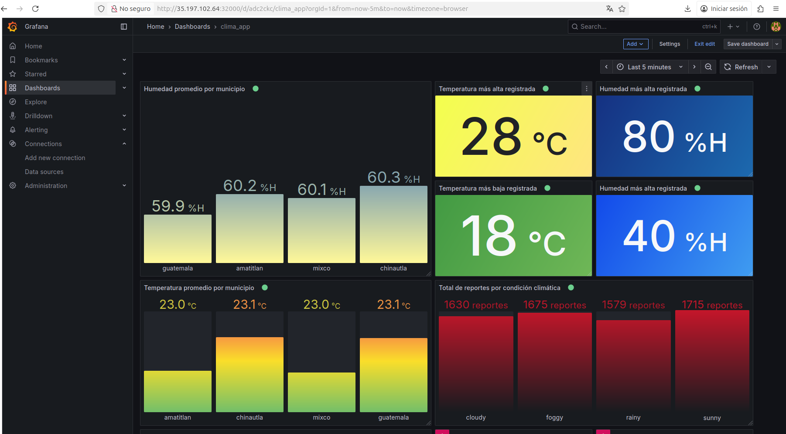
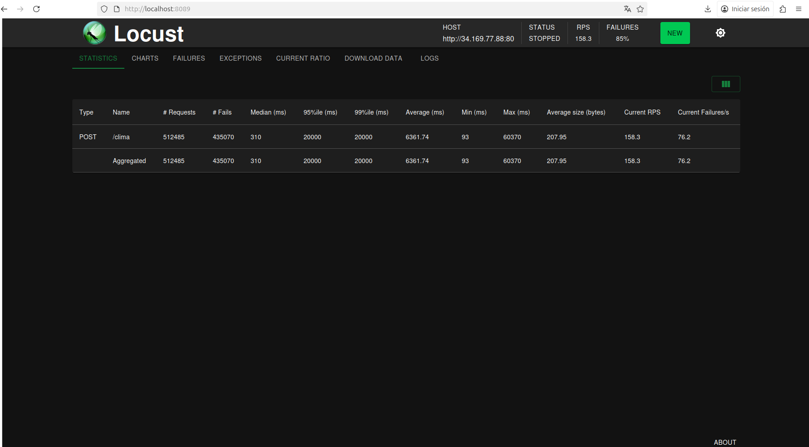
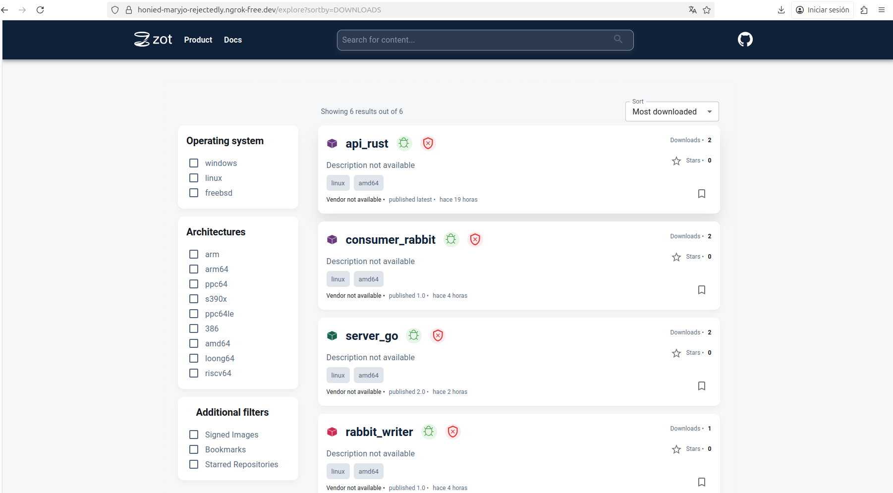

# Distributed Climate Monitoring Platform

Cloud-native academic project developed for **Operating Systems 1** at the
Universidad de San Carlos de Guatemala.

The system was designed to receive climate readings from multiple
municipalities, route those events through distributed services and messaging
systems, persist the information in Valkey, and visualize the resulting data
through Grafana.

## Architecture


The project combines synchronous service communication through REST and gRPC
with asynchronous processing through Kafka and RabbitMQ.

## Technology Stack

| Layer | Technologies |
| --- | --- |
| REST API | Rust, Actix Web |
| Internal communication | Go, gRPC, Protocol Buffers |
| Messaging | Apache Kafka, RabbitMQ |
| Consumers | Go |
| Data store | Valkey |
| Containers | Docker |
| Orchestration | Kubernetes |
| Cloud | Google Cloud Platform |
| Monitoring | Grafana |
| Load testing | Locust |
| Autoscaling | Kubernetes HPA |

## Components

### Rust REST API

The public-facing API is implemented in Rust and acts as an entry point for
climate data.

Source:

```text
api_rust/
```

### Go gRPC Server

Internal service communication uses gRPC and Protocol Buffers.

Source:

```text
server_go/
```

### Message Writers

Separate Go services publish events through the two messaging technologies used
in the project:

```text
go_services/
├── writer_kafka/
└── writer_rabbit/
```

### Consumers

The messaging pipelines include independent consumers for Kafka and RabbitMQ:

```text
consumers/
├── consumer-kafka/
└── consumer_rabbit/
```

The consumers process climate messages and interact with Valkey.

### Valkey

Valkey provides the in-memory persistence layer used for the processed climate
information.

Related source:

```text
valkey/
```

### Grafana

Grafana was used for dashboards and visualization.



The exported dashboard definition is available at:

```text
grafana/climaApp.json
```

### Load Testing

Locust was used to generate concurrent traffic and evaluate system behavior
under load.



Source:

```text
locust/locustfile.py
```

### Container Registry

During the original deployment, custom Docker images were stored in a private
Zot registry running on a separate virtual machine.



The public portfolio version no longer contains the historical registry
endpoint. Kubernetes manifests use `registry.example.com` placeholders instead.

## Kubernetes

The `yamls/` directory contains manifests for:

- Rust API
- Go server
- Kafka
- RabbitMQ
- Kafka writer
- RabbitMQ writer
- Kafka consumer
- RabbitMQ consumer
- Valkey
- Grafana
- Horizontal Pod Autoscaling

```text
yamls/
```

## Secrets and Configuration

Sensitive configuration is not stored directly in the source code.

The public manifests use Kubernetes `Secret` references where credentials are
required.

Example:

```text
yamls/secrets.example.yaml
```

To create a local version:

```bash
cp yamls/secrets.example.yaml yamls/secrets.yaml
```

Replace all `CHANGE_ME` values before use.

`secrets.yaml` is ignored by Git and must never contain credentials committed
to the repository.

## Validation

As part of preparing this project for public portfolio use:

- generated Linux-kernel build artifacts were removed from version control;
- Python cache files were removed;
- historical registry endpoints were replaced by placeholders;
- RabbitMQ credentials were removed from Go source code;
- Grafana and RabbitMQ Kubernetes credentials were moved to Secret references;
- affected Go modules were compiled through `go test ./...`.

## Historical Deployment

The original project was deployed to a Kubernetes cluster on Google Cloud
Platform.

The current public manifests should be treated as architectural/reference
artifacts rather than a turnkey deployment. Registry URLs and environment-
specific service configuration must be reviewed before redeployment.

## Original Documentation

The original course report is preserved in Spanish:

[Informe_Tecnico.md](./Informe_Tecnico.md)
